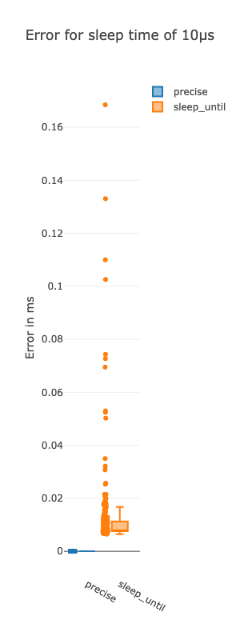
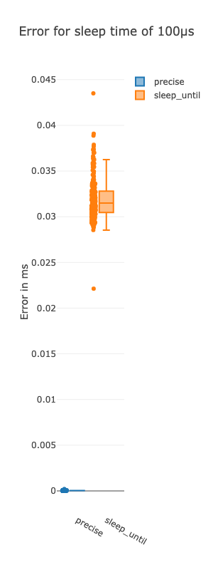
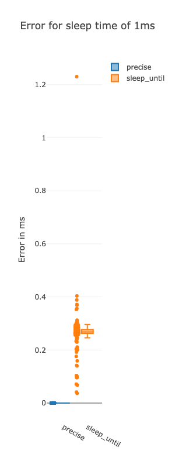
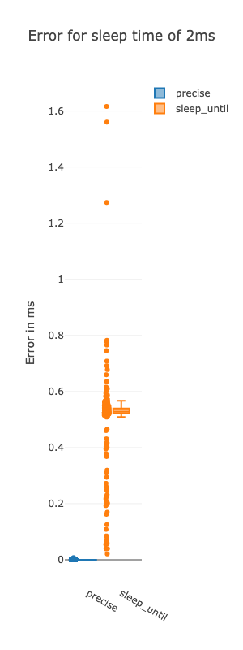
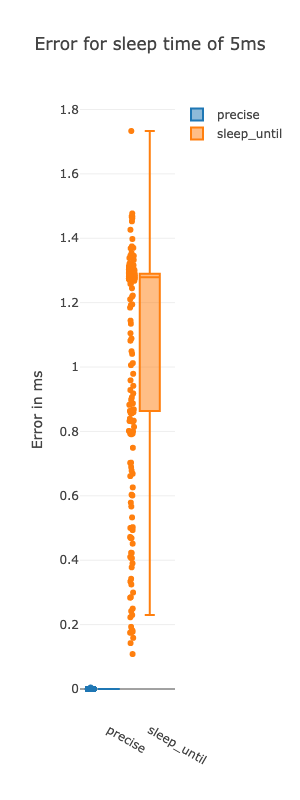
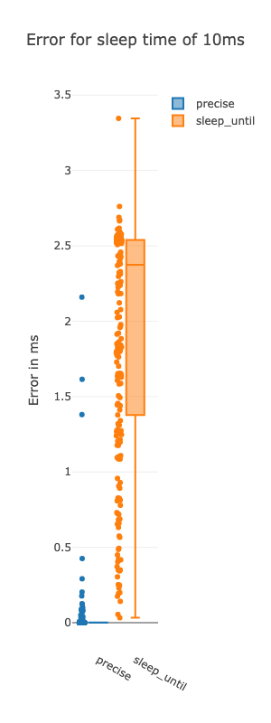
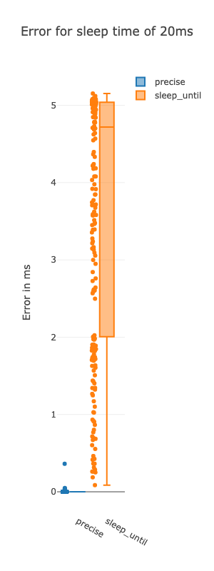
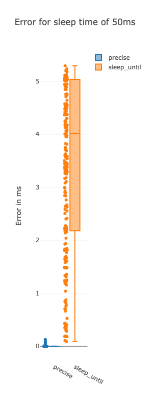
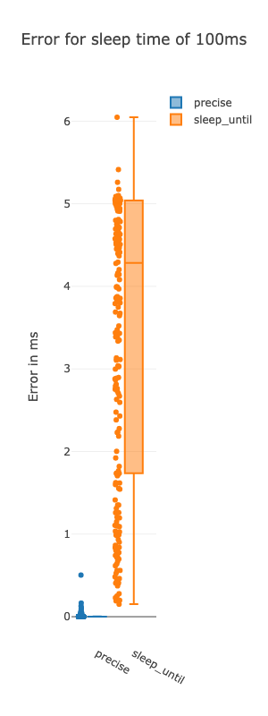

# License

[](https://opensource.org/licenses/Apache-2.0)

# Why?

In most programs, it isn't particuarly critical that a sleep for <i>N</i> ms sleeps for <i>N</i> ms.

Loops such as:

```c++
while(true)
{
    do_stuff();
    std::this_thread::sleep_for(std::chrono::milliseconds(10));
}
```

often don't care if the sleep is 10ms, or 12ms, or maybe even 20ms. The call to <i>do_stuff()</i> might catch up on all pending actions, recovering from inconsistent sporatic delays. Or the actions being performed don't have significant timing constraints.

You might be like me and not realize that there can be significant jitter when it comes to sleeping, until timing matters.

My use case was a software module that was a simulation of a hardware module that was sampling based on a hardware timer. In this case the code looked like:

```c++
auto next_run_time = std::chrono::steady_clock::now();
auto sleep_duration = std::chrono::milliseconds(5);

// track next_run_time to ensure sleep jitter is cancelled out
while(true)
{
    do_stuff();

    next_run_time += sleep_duration;

    std::this_thread::sleep_until(next_run_time);
}
```

I was seeing enough jitter at 5ms sleep that it was breaking the simulation model, and that kicked off this investigation.

# Results

Captured on MacBook Pro M3 running Sequoia 15.0.1.












# Background

Heavily based on:
* https://blog.bearcats.nl/perfect-sleep-function/
* https://www.reddit.com/r/cpp_questions/comments/bwhxlj/more_precise_timers/

# Usage

```c
template <class T>
void preciseSleepUntil(std::chrono::time_point<T> until_time);
```

* Copy precise-sleep-until.h or add this repo as a submodule to your project.
* Call preciseSleepUntil() with the time targetted to wake up.

# plot/ - visualize the sleep implementations

Rust app using plotlyjs to visualize precise-sleep vs. std::this_thread::sleep_for()

# Building

```
mkdir build
cd build
make plot-images
```

The PNG files in plot/ represent the the measurements for a given target sleep time.

## Display the images in the console (if you are using iTerm2 and have imgcat installed)

```
imgcat ../plot/*.png
```
